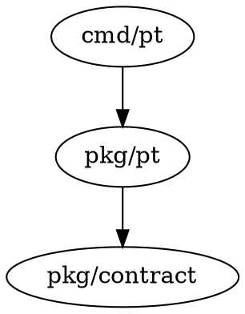

# Prime Output Contract (pt + treesitter-tools)

This document defines a **stable, agent-friendly contract** for “priming” output: a concise 10,000‑foot view of a codebase plus structured drill‑downs. It is designed to be:

- **Deterministic** (good for “dumb tools” and automation).
- **Composable** (agents can request deeper slices without rereading entire files).
- **Honest about coverage** (prevents false assumptions like “feature doesn’t exist”).

## Two Layers: Capability vs Guidance

1) **Capability (“dumb tool”)**: given an input query, return structured results (no opinions).
2) **Guidance (“smart prime”)**: curate + rank + suggest next queries; must still report coverage.

`treesitter-tools` should primarily be (1). `pt context prime` can implement (2) by combining capability outputs.

## Output Formats

- **Text (default)**: human-first, concise, safe to paste into an agent prompt.
- **JSON (`--json`)**: machine-first; stable keys for agents/orchestrators.
- **DOT (`--dot`)**: only for graph-shaped data (deps/callgraph), meant for `dot -Tpng`.

Rule: **Text and JSON must contain the same facts**, with JSON being more explicit.

## Required Concepts (all modes)

### 1) Coverage (mandatory)
Prime output must state what was scanned, what was skipped, and why.

- `scanned_files`, `skipped_files`
- `ignore_rules` (directories/patterns)
- `time_ms` and `partial` (true if budgets/limits were hit)

### 2) Enumerations vs Rankings

- **Enumerations** are “complete lists” within a bounded domain (e.g., top-level dirs).
- **Rankings** are “top N of M” lists; must always state **N and M**.

### 3) Stable References

Every code snippet/block must include:
- `path`
- `start_line` (1-based)
- `end_line` (1-based)
- `snippet_id` (stable enough to re-request; can be `sha256(path:start:end:text)`).

## Prime Output Schema (JSON)

Top-level shape:

```jsonc
{
  "version": "prime.v1",
  "root": "/abs/path/to/project",
  "coverage": {
    "scanned_files": 1284,
    "skipped_files": 412,
    "ignore_rules": [".git", "node_modules", "vendor", "dist", "build"],
    "partial": false,
    "time_ms": 2300
  },
  "inventory": {
    "languages": [{"lang":"go","count":620},{"lang":"ts","count":310}],
    "top_level_dirs": ["cmd","internal","pkg","projects","docs"]
  },
  "entrypoints": [
    {"kind":"go-cli","path":"cmd/pt/main.go"},
    {"kind":"sub-cli","path":"projects/codexacp-client/cmd/gemini-acp/main.go"}
  ],
  "rankings": {
    "hot_files_by_function_count": {
      "shown": 5,
      "total": 143,
      "items": [{"path":"cmd/pt/main.go","funcs":42}]
    },
    "top_imports": {
      "shown": 5,
      "total": 930,
      "items": [{"name":"context","count":88}]
    }
  },
  "risk_signals": [
    {"id":"go-no-panic","severity":"major","count":2},
    {"id":"go-log-fatal","severity":"major","count":1}
  ],
  "blocks": [
    {
      "snippet_id": "sha256:…",
      "path": "cmd/pt/main.go",
      "start_line": 220,
      "end_line": 340,
      "kind": "function",
      "name": "run",
      "text": "…"
    }
  ],
  "suggested_next": [
    "List commands: find functions in cmd/pt/main.go",
    "State transitions: show callers of Transitioner.Claim",
    "Storage: show types in pkg/pt/types.go"
  ]
}
```

Notes:
- `blocks[].text` is optional in “summary mode”; it may be omitted and fetched on demand.
- `risk_signals` should be derived from optional rules scans (treesitter-tools rules).

## Prime Output (Text) Example

```
PRIME (bounded): scanned 1,284 files; skipped 412 ignored; time 2.3s; partial=false
Languages (all): go(620), ts(310), tsx(110), md(90), yaml(30), other(124)
Top-level dirs (all): cmd/ internal/ pkg/ projects/ docs/ …

Entrypoints (curated):
- Go CLI: cmd/pt/main.go
- Sub-CLIs: projects/*/cmd/*/main.go

Hotspots (top 5 of 143 by function count):
- cmd/pt/main.go (42)
- pkg/pt/store.go (31)

Risk signals (optional rules):
- go-no-panic: 2 matches
- go-log-fatal: 1 match

Suggested next:
- Explore commands: treesitter-tools find --type function cmd/pt/main.go
- Trace a transition: treesitter-tools analyze callgraph --summary
```

## DOT Output (graphs only)

DOT output is for `dependency graph` or `call graph` summaries. Text/JSON should still summarize counts and coverage.

Example:



## Integration Guidelines (pt)

`pt context prime` should:
- Always show **coverage** and **inventory**.
- Provide **ranked** lists with “top N of M”.
- Provide **suggested_next** queries (strings) but not assume they were executed.
- Support `--json`; add `--discover` and `--rules` flags when integrating `treesitter-tools`.

## Integration Guidelines (treesitter-tools)

`treesitter-tools discover` should:
- Always report coverage and ignored patterns.
- Offer progressive detail flags (e.g., `--summary`, `--full`) and time budgets.
- Return stable block references for drill-down.

